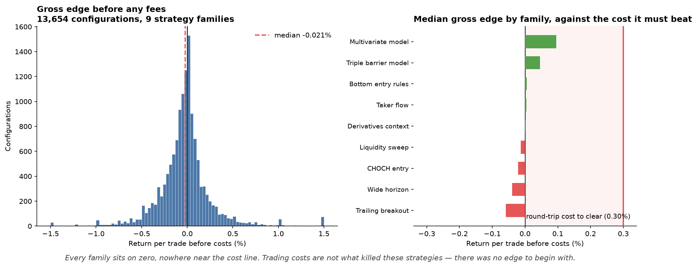

# AI Crypto Signal Engine

[](https://github.com/vinhnguyenthanhdn/ai-crypto/actions/workflows/ci.yml)
[](LICENSE)
[](https://www.python.org/)
[](docs/backtest-results.md)
[](docs/backtest-results.md)
[](CONTRIBUTING.md)

A research platform for systematically discovering — and rigorously falsifying —
crypto trading strategies, with event-sourced paper trading, implementation-parity
verification, and a full audit trail from raw candle to logged trade.

The system never places real orders. Every execution path is simulated.

> **29,373 strategy configurations searched. Zero promoted.**
> This repository publishes the machinery that reached that verdict, and the
> evidence that the verdict is trustworthy.



The chart above is the core result. It shows returns **before any fees**, across
every rejected configuration. If trading costs were the problem, the distribution
would sit to the right of the cost line. It sits on zero. Regenerate it yourself
with `scripts/plot_gross_edge.py`.

## Why this repository is worth reading

Most public trading repos show you a backtest with a nice equity curve. This one
shows you the **machinery that decides whether an equity curve is real**, and then
applies it honestly — including to its own results.

- **9 years of verified market data.** 942,025 5-minute candles plus 1,508
  checksum-verified derivatives archives, with SHA-256 dataset hashes recorded in
  every artifact.
- **Implementation parity, verified trade-for-trade.** Research reference engines
  and production strategy cores are written independently, then reconciled: 963/963,
  515/515, 1,079/1,079 trades matched with zero mismatches, and equity agreeing to
  8 decimal places.
- **Accelerated paper replay through the real lifecycle.** 3,277 days of history
  driven through the *production* SQLite state store, position sizing, and
  accounting — only the market clock is simulated. 77 ENTRY / 77 EXIT / 77 ledger
  rows, zero orphaned entries, zero positions left open.
- **Adversarial self-verification.** The engine was audited by reimplementing its
  contracts from scratch against raw data. The price cache matched the venue API
  **bit-for-bit** across 3,277 days; a rejected contract reproduced across
  **480/480** grid points; costs were confirmed charged exactly once
  (−0.29985% measured on a flat round trip against a stated 0.30%).
- **A look-ahead sensitivity test that actually has teeth.** Deliberately injecting
  look-ahead into the passing contract inflates training return from **+563% to
  +4,201%** — demonstrating the test could detect the bug, and that the committed
  result sits on the honest side of it.
- **Costs measured, not assumed.** 4,695 order book samples showed the real
  half-spread is 0.0077 bps, not the 5 bps the config assumed — and base-tier venue
  fees were pulled from official sources, revealing the project's own round-trip
  cost assumption was ~3× too high.
- **Every experiment documented, including the failures.** ~40 strategy families,
  100 result artifacts, each with its contract, dataset range, cost assumptions, and
  verdict.

## Engineering highlights

- **Event-sourced state.** Append-only `event_log`, `feature_snapshot`, and an
  idempotent `equity_ledger` keyed by trade ID. Position and risk are computed from
  real equity, not notional assumptions.
- **Feature lineage.** Every snapshot records source exchange, market type, symbol,
  timeframe, transformation version, and the strategy package that consumed it — so
  any logged decision can be reconstructed.
- **Atomic run locking.** SQLite `BEGIN IMMEDIATE` lease with owner token and
  heartbeat; a dead process's lease is reclaimed immediately rather than waiting out
  a stale timeout.
- **Frozen contracts and cost-stress gates.** Parameters are selected on the training
  split only, the contract is frozen, then validation and test are opened once. Every
  candidate must survive round-trip costs stressed to at least 2× base.
- **Market-data freshness enforcement.** Stale collector ticks hard-fail or force a
  fresh fetch rather than silently reusing an old snapshot.
- **Operational runtime.** launchd-managed scheduler, WebSocket collector with gap
  marking, independent health check, and a local dashboard with score/price timeline
  and trade history.

## Honest status: no validated edge yet

This is stated plainly because it is the most important thing to know, and because
publishing it is the point.

After searching **29,373 parameter configurations** across ~40 strategy families,
**no strategy has passed the project's own promotion gates**, and live forward paper
trading has produced **zero closed trades** to date.

The negative result is itself the finding, and it is quantified rather than
hand-waved:

- Median gross edge — return *before any fees* — across 13,654 rejected
  configurations is **−0.021%**, statistically indistinguishable from zero.
- Recomputed independently from raw candles, common intraday signals (EMA cross,
  breakout, momentum, taker imbalance) return **+0.01% to +0.05%** forward, versus
  the asset's own baseline drift of **+0.019%**. The signals are the drift.
- Consequently, **reducing trading costs to zero would not rescue these families.**
  There is no gross edge to rescue.
- Maker execution does not fix it either: L2 replay measured markout of **−15 to
  −29 bps** against roughly 5.4 bps of fee savings. Adverse selection dominates.

| Finding | Evidence |
|---|---|
| Intraday directional signals have ~zero gross edge | 13,654 configs, median gross −0.021% |
| Cost assumptions were ~3× too high | Base-tier fee schedules + 4,695 book samples |
| The one contract with real gross edge is low frequency | 253 test tickets → 41 independent excursions, t-stat 0.57 |
| Backtest and live rule engine implement *different* strategies | `docs/code-audit.md` |

Negative results at this scale are rarely published. The search space is documented
well enough that you can avoid re-walking it.

## Two code paths, two trust levels

This distinction matters before relying on any number in the repository.

- **Research path** (`scripts/discover_*.py`, `scripts/analyze_*.py`) — produces
  every artifact in `data/backtests/`. Independently verified and **trusted**: data
  integrity, cost accounting, and causal correctness all reproduce against
  from-scratch reimplementations.
- **Runtime path** (`src/run.py`, `src/backtest/engine.py`,
  `src/indicators/technical.py`) — has confirmed defects, including a BUY threshold
  that is arithmetically unreachable and a look-ahead bug in the swing detector.
  These are catalogued with file and line references rather than quietly patched.

Full detail in `docs/code-audit.md`.

## Architecture

Two pipelines run over the same market data and meet at one place: the frozen
strategy core. What each pipeline builds *around* that core is written separately,
which is what the parity numbers above actually test.

```text
                     ┌──────────────── research path ────────────────┐
Exchange ─→ Fetch ─→ │ discover_*.py → analyse → freeze contract      │ ─→ data/backtests/*.json
   │                 │      (parameter search on the training split)  │      (result artifacts)
   │                 └───────────────────────┬───────────────────────┘
   │                                         │  src/engine/*.py
   │                                         │  FROZEN_CONTRACT
   │                                         ▼
   │                 ┌──────────────── runtime path ─────────────────┐
   └──→ Collector ─→ │ Feature Engine → Rule Engine → Risk Engine →  │ ─→ SQLite state store
        (WebSocket)  │ Paper Execution                               │      event_log
                     └───────────────────────────────────────────────┘      equity_ledger
                                                                            feature_snapshot
                                                                                  │
                                                                                  ▼
                                                                            Report / dashboard
```

Reading the diagram:

- **The research path searches; the runtime path executes.** Parameters are chosen
  on the training split only, then the contract is frozen into `src/engine/` and the
  runtime is never allowed to retune it.
- **Parity is a replay, not a diff.** `scripts/validate_funding_crowding_parity.py`
  and `scripts/verify_staggered_runtime_parity.py` drive the production strategy core
  (`entry_plan`, `exit_decision`, `rank_entries`) through an independently written
  execution loop over the same window the research loop covered, then match the two
  ledgers trade-for-trade. Be precise about what that buys: the signal logic is
  shared by construction, so parity cannot vindicate it. What parity does catch is
  divergence in everything wrapped around it — position bookkeeping, timing, cost
  application, ledger accounting — which is where backtest-versus-live disagreements
  in this repository have actually come from.
- **State is the audit trail, not a cache.** Every decision lands in the append-only
  `event_log` with a `feature_snapshot` recording exactly which inputs produced it,
  and money moves only through the idempotent `equity_ledger`. Any logged trade can
  be reconstructed from these three tables without rerunning the engine.
- **The runtime is a pure rule engine.** Entry models, RAG, and champion/challenger
  model serving exist as scaffolding and do not participate in decisions.

Trust levels differ between the two paths — see
[Two code paths, two trust levels](#two-code-paths-two-trust-levels) before relying
on a number from either.

```text
src/           Runtime: collector, indicators, decision/risk engines, state store
src/backtest/  Backtest and accelerated paper-replay engines
src/engine/    Strategy cores (staggered pullback, BTC spot trend, funding crowding)
scripts/       Research harness: discovery, analysis, validation, dashboard
docs/          Decisions, results, audits, open tasks
knowledge/     Human-readable model cards and lessons
```

Datasets and result artifacts are **not committed** — they are large and fully
reproducible from the fetch scripts.

## Setup

```bash
python3 -m venv .venv
source .venv/bin/activate
pip install -r requirements.txt
cp .env.example .env
```

API keys must be **read-only**. Never grant trade or withdraw permissions. The
system works without keys using public market data. Telegram credentials are
optional.

## Running

```bash
# single pass
python3 -m src.run

# fast bar-close backtest scan
.venv/bin/python3 scripts/run_backtest.py

# tick-proxy paper-parity backtest
.venv/bin/python3 scripts/run_paper_backtest.py \
  --timeframe 1h --tick-timeframe 1m --days 180 --walk-forward 2 --no-mlflow

# local dashboard, binds 127.0.0.1:8787, session/password auth
.venv/bin/python3 scripts/dashboard_server.py
```

Scheduled paper trading runs under launchd on macOS. See `docs/decisions.md` for the
scheduling contract.

### Run it in a container

```bash
docker build -t ai-crypto .
docker run --rm --network none ai-crypto
```

That prints the regression suite, `Ran 19 test file(s), 0 failed.`, from an image
with no network, no credentials and no mounted volume. The same two commands run
in CI on every push, and the CI step fails unless the count in that line matches
the number of test files in the checkout — so an image that quietly stops running
part of the suite is a red build, not a green one.

The image pins the interpreter and the dependency set. It is the shortest way to
reproduce a result on a machine that has no Python toolchain, and the shortest
way to check that a dependency change did not break anything outside the two
Python versions the matrix covers.

**What the container does not do.** It has never been deployed anywhere. Live mode
(`python3 -m src.run`) needs outbound network access to an exchange and a
configuration file, and neither is baked into the image or exercised by CI — the
container is verified offline only. There is no orchestration, no scheduler and
no published image; scheduled paper trading still runs under launchd on the
author's machine, as described above.

Three properties CI asserts about the image, each as a separate step, because a
build that succeeds says nothing about what it produced:

- it runs the full suite with `--network none`, and the count matches the checkout
- it does not run as root, and cannot write to its own source tree
- `/app/config` is empty and there is no `/app/data`

The container has already paid for itself once: it found that `lightgbm` fails to
import on any minimal base image, because it links against the OpenMP runtime and
`python:3.12-slim` does not carry it. Both matrix legs were green — the GitHub
runner image happens to ship `libgomp1` — so the failure was invisible until
something ran the code somewhere else.

### Run it with compose

```bash
docker compose up -d --wait
curl -fsS http://127.0.0.1:8787/api/session   # {"authed":false}
docker compose down -v
```

Building an image and starting a service are different claims, and the steps
above check the second one. `--wait` blocks until the container runtime reports
the service healthy and exits non-zero if it never does, so "it came up" is a
verdict from the runtime rather than from a person reading logs. The probe is
`/api/session`, the one route that answers before anyone logs in: a 200 there
means the module imported, the session secret exists, and Flask is serving.

CI runs the same three commands on every push and then checks the result from
outside the container as well — `docker inspect` must report `healthy`, and the
published port must return that exact body. A service that starts and then
fails its probe is a red build.

Two details worth knowing before running it locally:

- The port is published on `127.0.0.1` only. The server's own default bind is
  loopback as well; remote access is meant to go through a tunnel that dials
  out, not through a port opened on a public interface.
- `config/` is a named volume. The dashboard mints a session secret on first
  import and prints a one-time password; without the volume that happens again
  on every recreate, and the secret would land in the source tree.

**What compose does not claim.** Flask's built-in server is a development
server, and nothing here has been deployed to a hosted account — there is no
image published, no infrastructure defined and no load ever put through it.
What is verified is the narrow thing stated above: the service starts, stays up,
and answers.

### Infrastructure

`infra/scheduled-task.yaml` declares what a scheduled run of the container would
need on AWS: an EventBridge schedule starting one Fargate task, a log group, and
an EFS volume for the SQLite state file. CI lints every template under `infra/`
on each push.

Three choices in it are decisions rather than defaults:

- **A durable volume, not ephemeral task storage.** Position state, the equity
  ledger, the run heartbeat and the kill switch all live in one SQLite file. On
  Fargate's own storage every run would start believing nothing had happened —
  including that the kill switch is off.
- **The access point owns its directory as uid 10001**, the uid the image runs
  as. A mismatch there is the ordinary way a non-root container ends up unable
  to write the volume it was given.
- **No retries, no flexible time window.** A retried run of a trading engine is
  a second decision taken on stale prices, and the engine's run lock treats a
  stale lock as abandoned after `RUN_LOCK_STALE_MINUTES`, so schedule drift
  widens the window where two runs overlap.

The task role is deliberately empty: the engine talks to an exchange over HTTPS
and to a file, and holds no AWS permissions.

**What "validated" covers, and what it does not.** This template has **never
been deployed to an account**. No stack has been created, nothing has been
billed, and no value here has been confirmed against a live API. What CI proves
is that the template is structurally valid CloudFormation — and it proves the
linter can fail, by feeding it a broken copy on every run and requiring the
rejection.

That boundary is narrower than it looks, and the repository would rather name it
than imply otherwise: changing the access point's uid from 10001 to 0 — which
would break the non-root container at runtime — passes `cfn-lint` cleanly. A
structural gate catches structural errors. Nothing here checks that the stack
does what the comments say it does.

## Operations

What can be observed while this runs, with what, and what to read first when it
stops. Everything below points at something in this repository; the last
subsection is the part that is missing, stated as missing.

### Liveness

`src/run.py` writes `run_health(last_run_at, last_run_ok)` at the end of every
cycle and again when a cycle raises. That row is the heartbeat, and it is the
only thing that distinguishes "made no trades" from "was not running".

`scripts/health_check.py` reads it and alerts over Telegram when the heartbeat
is older than `HEALTHCHECK_MAX_STALE_MINUTES` (default 30). Two properties of it
are deliberate:

- **It is scheduled separately from the engine.** A check that runs inside the
  process it watches cannot report that the process is gone, which is the one
  failure it exists for.
- **It is edge-triggered, except when it cannot be.** Alerts fire on the
  transition into unhealthy and once more on recovery, so a long outage is not a
  stream of messages. If the database itself cannot be read, dedupe state lives
  in that same unreadable database — so it alerts on *every* run instead of
  going quiet. Losing the ability to remember is not a reason to stop speaking.

### Stops

Every gate below can refuse an entry on its own, in the order `_handle_entry`
applies them. Each one logs a `RISK_REJECTED` event naming itself, so the
question "why did it not trade" is answered by reading the `gate` field rather
than by inferring it from the score:

| Control | Default | `gate` logged | Refuses when | Clears itself |
|---|---|---|---|---|
| `MAX_DRAWDOWN_PCT` | 15 | `kill_switch` | Peak-to-trough drawdown reaches the limit; `src/run.py` arms the kill switch itself | **No** — a human clears it |
| `COOLDOWN_MINUTES` | 30 | `cooldown` | Less than this long since the last exit | Yes, when the window elapses |
| `DAILY_LOSS_LIMIT_PCT` | 5 | `daily_loss_halt` | Realized loss for the UTC day reaches the limit, tracked in `daily_pnl` | Yes, at the next UTC day |
| `MAX_CROSS_EXCHANGE_DIVERGENCE_PCT` | 0.15, and the gate is off unless `CROSS_EXCHANGE_DIVERGENCE_GATE_ENABLED=true` | `basis_risk` | The reference price diverges from the execution venue past the limit — read as a data fault, not a signal | Yes, when the prices reconverge |
| `MAX_CONCURRENT_POSITIONS` | 1 | `max_concurrent_positions` | Open positions already fill every slot | Yes, when a position closes |
| `MIN_TP_COST_RATIO` | 2.5 | `cost_gate` | Take profit is not this many times the round-trip cost away from entry | Yes, on the next setup that clears it |

`RUN_LOCK_STALE_MINUTES` (default 5) is not an entry gate: it is the `run_lock`
heartbeat age after which a lock is treated as abandoned, so a killed process
cannot lock the engine out forever.

The last column is the distinction that matters when one of these is holding the
system back, and it is why the kill switch is a separate layer rather than a
longer cooldown. Everything else in the table is a pause that ends when the
condition that raised it ends. The kill switch is asymmetric on purpose: the
system arms it automatically and never disarms it automatically, because a
drawdown is a peak-to-trough historical level and does not fall back on its own.
Clearing it is `python scripts/kill_switch.py off`, a human action.
`kill_switch.py status` reports the current state and the recorded reason.

`MAX_HOLD_MINUTES` (default 1440) is the other half of the same concern and is
not in the table because it refuses nothing: it is the horizon past which an open
position is closed by `TIMEOUT_EXIT`, applied by both exit paths `_handle_exit`
can take. Setting it to `0` turns the horizon off rather than closing everything.

Each of the first three, plus the horizon, has a gate under `scripts/`:
`test_kill_switch_asymmetry.py`, `test_cooldown_window.py`,
`test_daily_loss_limit.py` and `test_max_hold_timeout.py`. The last three rows of
the table are not covered yet, and that is stated here rather than left for a
reader to discover.

### What to read, in order

1. `python scripts/kill_switch.py status` — if it is on, the reason string says
   why and nothing further will trade until it is cleared.
2. `run_health.last_run_at` — via `scripts/health_check.py` or the dashboard's
   `/api/status`. This separates a dead scheduler from a running engine that is
   declining to act.
3. `event_log` — `(ts, trade_id, type, payload)`, indexed on `(type, ts)`. This
   is the per-decision trail; `signal_log` and `equity_ledger` hold the scored
   candidates and the balance history behind it.
4. The scheduler's own stdout, for anything that failed before Python could
   record it.

### Where the logs are not

This is the honest gap in the list above. `config.LOG_PATH` exists and defaults
to `logs/run.log`, and **nothing reads it** — no module in `src/` or `scripts/`
consumes that value. Logs land wherever the scheduler redirects stdout, which
for the committed launchd job is `StandardOutPath` in its plist, and the
dashboard's log view reads a third, hard-coded path
(`logs/run_paper_launchd.log`) that is not derived from either. Three names for
one concern, with no single place that decides it.

Nothing here is centralized, aggregated or retained on a schedule: there is no
log shipping, no metrics backend, no dashboards other than the local Flask app,
and no alerting channel besides Telegram. Rotation is whatever the operating
system's scheduler does. Read this section as the observability that exists, not
as an observability design.

## Documentation

| File | Contents |
|---|---|
| `docs/decisions.md` | Stable architectural decisions and the objective function |
| `docs/backtest-results.md` | Every experiment run, including all rejections |
| `docs/inprogress.md` | Active experiments and blocking work |
| `docs/todo.md` | Not-yet-started tasks and known risks |
| `docs/execution-cost.md` | Measured fees, slippage, tax, venue constraints |
| `docs/code-audit.md` | Per-branch code trust levels and confirmed bugs |
| `CHANGELOG.md` | Released versions, what changed, and known limitations per release |

Documentation follows a single-source-of-truth rule: each fact lives in exactly one
file. Please preserve that when contributing.

## Limitations

What this repository does *not* do, so you can decide in one screen whether it is
useful to you. (What it *found* is a separate matter — see
[Honest status](#honest-status-no-validated-edge-yet).)

**Scope**

- **It never trades.** No order-placement call exists anywhere in `src/` or
  `scripts/`; there is no code path from a signal to a venue, disabled or otherwise.
  Adding one is your work, and `docs/code-audit.md` lists what you would have to fix
  first.
- **One instrument at runtime.** The runtime is configured for a single spot symbol
  on a single timeframe at leverage 1 (`SYMBOL`, `TIMEFRAME` in `.env.example`).
  Multi-asset work exists only in the research scripts.
- **Two venues, both read-only.** OKX is the primary exchange and Binance the second
  collector source. Nothing else is implemented, and API keys must have no trade or
  withdraw permission.

**Statistical**

- **No multiple-testing correction is implemented.** There is no deflated Sharpe, no
  White reality check, no PBO, and no trials counter in the discovery scripts. With a
  search of this size, a holdout profit factor near 1.0 is inside selection noise and
  nothing in the code currently says so. This is the single largest gap in the
  research path — tracked in
  [#6](https://github.com/vinhnguyenthanhdn/ai-crypto/issues/6), scoped down to the
  trials counter so it fits one pull request.
- **The negative result is about the families searched here**, on this data, under
  these cost assumptions. It is not a claim that no intraday edge exists.

**Operational**

- **Scheduling is macOS-only.** The scheduler is a launchd agent, and the installer
  under `scripts/` still contains absolute paths from the author's machine, so it
  needs editing before it runs anywhere else. There is no Linux or Windows equivalent.
  CI bootstraps the committed plist into launchd on a macOS runner and reads the job
  back from launchd — program, working directory, log paths and the calendar interval —
  with only that author path prefix retargeted. What that does not prove: the observer
  has never been started by launchd anywhere but the author's machine, and the gate
  removes `RunAtLoad` rather than letting a CI runner start it.
- **The dashboard is local-only** — it binds `127.0.0.1` and is not meant to be
  exposed.
- **Python 3.10 and 3.12 are what CI proves.** Other versions may work; nothing
  verifies that.

**Reproducibility**

- **Datasets and result artifacts are not committed** — they are large, and the
  fetch scripts rebuild them. Expect a long first run.
- **One end-to-end test cannot run on a clean checkout** and prints `SKIP` rather
  than failing, so a green CI does not mean it was graded. Which test, what it needs,
  and why it stays that way: `docs/test-coverage-gaps.md`.

## Contributing

Contributions are welcome — see [CONTRIBUTING.md](CONTRIBUTING.md) for the full
guide, and the [`good first issue`](https://github.com/vinhnguyenthanhdn/ai-crypto/issues?q=is%3Aissue+is%3Aopen+label%3A%22good+first+issue%22)
label for self-contained bugs with known locations.

The work that would help most, roughly in order:

1. **Fix the runtime-path bugs** in `docs/code-audit.md`. Several are self-contained
   and well-localized — a good first contribution.
2. **Add multiple-testing corrections.** There is currently no deflated Sharpe, no
   White reality check, no PBO. With ~29k configurations searched, any test-split
   profit factor near 1.0 is inside selection noise, and nothing in the codebase
   currently says so.
3. **Falsify the remaining candidate.** The staggered pullback contract has positive
   gross edge but only 41 independent excursions. Applying the frozen contract to a
   point-in-time multi-asset universe would test it without adding search burden.
4. **Challenge the negative results.** If you think a family was rejected for the
   wrong reason, every contract and artifact is here. Reproduce it and show the work.

Ground rules that keep results meaningful:

- Select parameters on the training split only. Never tune against a holdout you have
  already seen.
- Freeze the contract before opening validation or test.
- Report costs explicitly and stress them to at least 2× base.
- A rejection is a result. Do not delete it.
- Do not commit datasets, databases, credentials, or runtime config.

Open an issue before large changes so direction can be discussed.

## Disclaimer

This is research software — not financial advice, and not a trading product. It has
no demonstrated profitability. Cryptocurrency trading carries substantial risk of
loss. If you adapt this toward live execution you do so entirely at your own risk,
and you should read `docs/code-audit.md` first to understand what is known to be
broken.

## License

MIT — see [LICENSE](LICENSE). Copyright (c) 2026 vinh.nguyenthanhdn.
